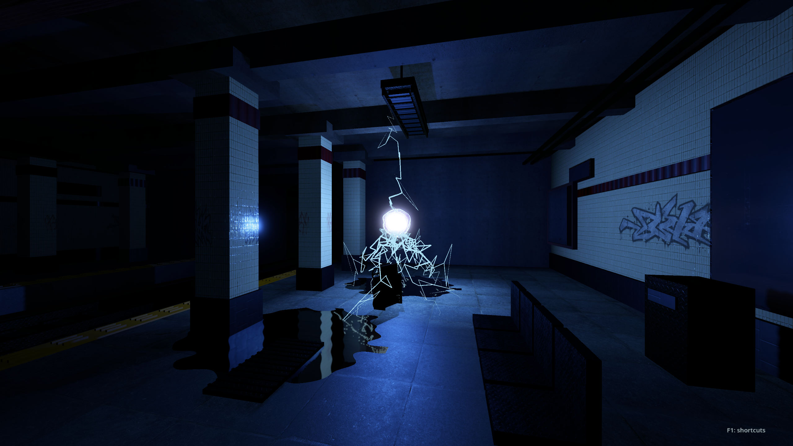
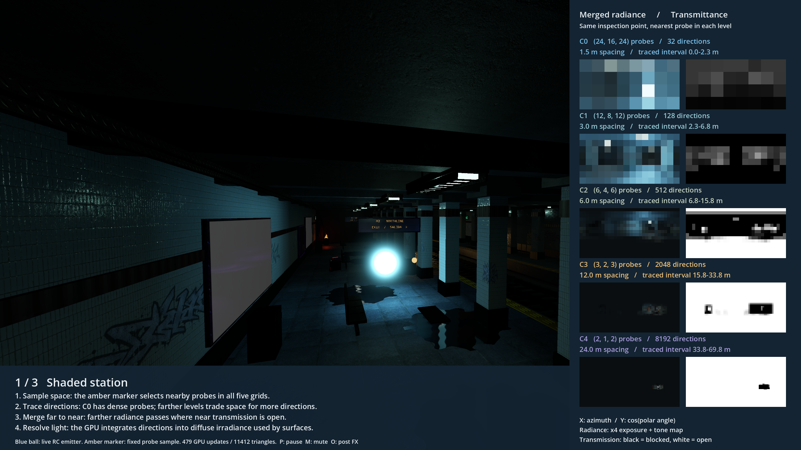
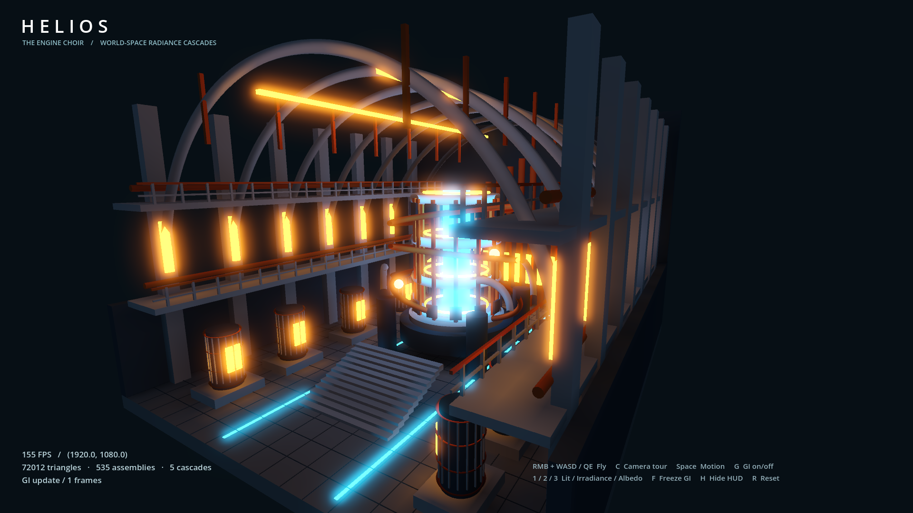

# NORTHLINE / HELIOS — 3D Radiance Cascades for Godot

A GPU global-illumination experiment with arbitrary triangle mesh support and two **2560 × 1440 fullscreen** showcases: the NORTHLINE metro station and the HELIOS reactor hall. Five world-space radiance cascades light the scenes from emissive geometry, with diffuse bounce feedback and moving emitters.



**Yes, this uses GPU shaders.** Vulkan compute shaders trace rays through a triangle BVH, merge cascades, and resolve diffuse lighting. Godot spatial shaders sample the result. The CPU builds the static BVH and uploads moving analytic objects; it does not calculate the lighting. No hardware ray-tracing extension, native module, Blender installation, or baked lightmap is required.


## Implementation map: CPU, GPU and paper coverage

The implementation is an **approximate world-space diffuse RC solver**, not a full
implementation of every technique in the [Radiance Cascades paper](https://github.com/Raikiri/RadianceCascadesPaper/blob/main/out_latexmk2/RadianceCascades.pdf).
The comparison below was checked against the official repository's
[LaTeX source](https://github.com/Raikiri/RadianceCascadesPaper/blob/main/RadianceCascades.tex),
especially “Radiance Interval”, “Radiance cascades”, “3D space” and
“Calculating indirect lighting with radiance cascades”. The paper presents a
general representation and several implementations, not one mandatory engine recipe.

| Responsibility | Where it runs | Source |
| --- | --- | --- |
| Extract mesh triangles, material factors and transforms; build binned-SAH BVH | CPU, once at setup or explicit rebuild | [rc_mesh_bvh.gd](addons/radiance_cascades/rc_mesh_bvh.gd) |
| Pack up to 64 moving analytic shapes; install materials; schedule updates | CPU / render-thread orchestration | [radiance_cascades.gd](addons/radiance_cascades/radiance_cascades.gd), [rc_primitive.gd](addons/radiance_cascades/rc_primitive.gd) |
| Allocate buffers, compile shaders, dispatch cascade passes and barriers | CPU via Godot RenderingDevice | [rc_gpu.gd](addons/radiance_cascades/rc_gpu.gd) |
| Trace finite ray intervals against analytic shapes and triangle BVH | GPU compute | [common.glslinc](addons/radiance_cascades/shaders/common.glslinc), [mesh.glslinc](addons/radiance_cascades/shaders/mesh.glslinc) |
| Interpolate and merge far-to-near radiance/transmittance | GPU compute | [cascade.glslinc](addons/radiance_cascades/shaders/cascade.glslinc) |
| Cosine integration into six directional irradiance lobes; temporal blending | GPU compute | [resolve.glslinc](addons/radiance_cascades/shaders/resolve.glslinc) |
| Gather field, shade normals, sample PBR textures and parallax | GPU raster shaders | [surface.gdshader](addons/radiance_cascades/shaders/surface.gdshader), [pbr_surface.gdshader](addons/radiance_cascades/shaders/pbr_surface.gdshader) |
| Walking, procedural scene assembly, animation, audio and Theora decoding | CPU | [scripts/](scripts/) |

**How the cascades work.** Five levels start with a 24 × 16 × 24 probe grid.
Each successive level doubles spatial spacing and both angular dimensions;
direction counts are 32, 128, 512, 2048 and 8192. The grid dimensions use ceiling
division, so finite-level storage does not exactly follow the ideal asymptotic ratio.
For base spacing `s`, interval endpoints are
`0.75 × (2^i − 1, 2^(i+1) − 1) × s/0.5`.
Each stored direction traces four angular children, merges each child's near
visibility with interpolated far radiance, then averages. Composition is
`L = Lnear + Tnear × Lfar`, `T = Tnear × Tfar`.
Empty intervals transmit; opaque hits stop transmission.
The highest level terminates in constant sky radiance, not an infinite scene.
Cascade zero resolves to a six-lobe RGBA16F atlas. Subsequent frames feed the
previous irradiance back into diffuse hit radiance; this is a damped iterative
approximation, not an unbiased multi-bounce path tracer. Production lighting
does not read results back to the CPU; numerical tests do.

| Paper idea / capability | Status here |
| --- | --- |
| Spatial/angular scaling, adjacent radiance intervals, interval composition | Implemented with a fixed 3D grid, equal-area directional sampling and trilinear spatial interpolation |
| Diffuse integration of the merged base cascade | Implemented, then reduced to six axis lobes; arbitrary-normal reconstruction adds approximation |
| Interval shifting / exponential extension to avoid tracing long intervals | Not implemented as cached extension; each interval is intersected directly |
| Roughness-dependent specular cone queries / arbitrary BRDF or BSDF convolution | Not implemented; Godot highlights and planar mirrors are separate raster effects |
| Participating media, continuous transmittance, atmospheric scattering from the RC field | Not implemented; ray hits are opaque. Native spotlight haze is not RC scattering |
| Surface-space and screen-space cascades, depth-aware interpolation and reprojection | Not implemented; the field stays in world space. Temporal irradiance blending is not screen-space reprojection |
| PoE2 screen-space multi-ray/128-bit visibility optimization | Not implemented |
| Voxelized 3D testbed, SDF marching, precomputed direct field viewer | Not implemented; this uses analytic intersections plus software triangle-BVH tracing |
| Infinite extent, arbitrary precision / resolution | Not implemented; finite range, fixed direction bins and clamped boundary probes |

Additional project limitations: static triangle topology, no skinned meshes,
no texture-resolved ray-hit albedo, no refraction, no adaptive/sparse streaming,
no hardware ray-tracing backend, no demonstrated path-traced reference-error bound.
Thin walls, small emitters and normal bias can produce leaks or missed lighting.
The paper's penumbra hypothesis is not a proof that this particular discretization
has no artifacts. Metre-scaled material parallax is unrelated to interval shifting.

## Scene picker and small reference scenes

### Northline crossing event

Once walking, cross the rails and reach the opposite (narrow) platform. A one-shot
sequence flickers the lighting for two seconds, blacks out for one second, then
releases a blue-violet plasma orb with branching, growing electrical filaments.
It travels along the broad **puddled platform**, crosses over the rails and waits for physical
contact with the next train. Godot sphere-overlap queries use the train's actual
eight-car collision shapes, not a timed fake impact. Contact fades to black over
1.5 seconds, holds black for **five seconds**, then replays the three original
static camera views as a **31-second diagnostic epilogue** (15, 8 and 8 seconds),
without an on-screen timer.
Four explanations fade in at 0, 2.5, 5 and 7.5 seconds, then remain readable.
An eight-second thank-you screen credits the asset creators and displays
`github.com/gomezzz/godot-3d-radiance-cascades` as large, screenshot-friendly plain text
before returning to the picker.

The epilogue explicitly restores station power for inspection. Its views show
the shaded station, resolved RC irradiance, then surface albedo. Alongside each
are real **C0-C4 merged-radiance and transmittance maps**, sampled at the nearest
probe to an amber inspection marker. Each level lists grid dimensions, direction
count, spacing and traced interval. Horizontal map position is azimuth; vertical
position is cosine of polar angle. Radiance is displayed at x4 exposure with
tone mapping; transmittance is black for blocked and white for open. These are
merged directional intervals, **not additive per-cascade light contributions**.
The 256x640 RGBA16F diagnostic atlas is populated directly from production GPU
buffers by [debug.glslinc](addons/radiance_cascades/shaders/debug.glslinc), with no
runtime CPU readback. It is allocated/dispatched only when requested. The overlay
and timing live in [metro_debug_epilogue.gd](scripts/metro_debug_epilogue.gd).
P pauses the epilogue and GPU updates; M remains available to mute.

**Flashing-light warning:** select **Reduce flashes** in the picker for a smooth
power fade and gentler orb pulse. This reduces the event's flashes, not every
existing metro lamp/flashlight effect. P pauses the event; M mutes its audio.
Replay/skip controls are locked once it starts so the train timeline stays coherent.

[metro_lightning.gd](scripts/metro_lightning.gd) animates crossed filament ribbons
on the CPU; [ball_lightning.gdshader](shaders/ball_lightning.gdshader) shades the
plasma on the GPU. One moving analytic emitter feeds RC diffuse transport;
a native shadowed light supplies PBR highlights, and the existing planar reflection
cameras render the orb/arcs. This is an artistic electrical effect, not a plasma
simulation. Real CC0 sparks are convolved offline with a synthetic station-sized
impulse response; see [audio credits and rebuild instructions](assets/audio/ATTRIBUTION.md).
The barrel now emits folded ash flakes with drag and an orange-to-grey-to-black
cooling ramp; only their hot phase emits light.

The core's actual vertex positions bulge, distort and pulse, rather than only
changing colour. Arc endpoints are physics ray hits against station geometry;
crossed ribbons taper to zero at their surface contacts. After the blackout,
lamps, train illumination, display emission and the drone searchlight stay off;
the orb and barrel dominate the lighting. The original opposite-platform crossing
still triggers the event. Ember shaders consume each particle's randomized angle
and apply a second tumble axis, so flakes do not share one orientation.

The orb now has a compact HDR white-hot centre and a localized screen-space heat
distortion shell. Filaments use more jagged subdivisions and a 3–5 m contact range.
It travels from z=16 to z=-16 over 18 seconds before crossing the rails over four
seconds. The drone approaches the platform midpoint; proximity to the orb cuts
its motors and it tumbles down using Godot collision queries. Red/blue navigation
beacons remain visible on battery power until the drone crashes; other station
lighting stays off. Its normal patrol uses independent lateral, vertical and
banking motions within the existing sign/ceiling clearance envelope.

Track crossings have a walker-only smooth collision surface just above the rail
heads, removing catches on sleepers and fasteners without changing ray-traced
geometry. The train mix is 12 dB louder before spatial attenuation, tracks the
nearest carriage, and has a -1 dB digital peak limiter while the metro is active.
Start with modest speaker/headphone volume; M still mutes the scene. The limiter
prevents digital overs, not unsafe listening levels at high device volume.

### Reference controls

F5 (or `tools/run.ps1`) opens the keyboard-accessible picker.
Choose **Cornell box** for two rotated boxes, red/green walls and one emissive
ceiling panel, or **Occlusion study** for a moving cyan emitter, a sphere and
three blockers. These are original small teaching scenes, not imported benchmark
datasets. Cornell has **no native Light3D nodes**. The occlusion study now uses
a true moving point source: Godot renders direct PBR illumination and cube shadows
with a 4096-pixel shadow atlas; the compute tracer explicitly samples the same
point at surface hits, checks analytic/BVH visibility and injects its diffuse
reflection into RC. This avoids missing a tiny emitter between angular bins.
It is a hybrid reference, not an RC-only direct-shadow demonstration. Its wall
and floor use Poly Haven concrete albedo/normal/roughness maps; the sphere has
96 radial segments and 48 rings. Neither scene uses baked lighting or ambient fill.
G removes RC surface illumination (only indirect in the point study); B disables
bounce feedback including point-to-surface injection; Space pauses
motion; Escape returns to the picker. See [classic_example.gd](scripts/classic_example.gd).
The integration test checks GPU readiness and rendered changes with GI and bounce
disabled; it is not a quantitative reference-renderer comparison.

The reference scenes enable `visibility_merge`: GPU rays reject coarse-probe
interpolation neighbours separated by solid geometry, then renormalize the
remaining weights. This addresses cross-blocker interpolation leakage but costs
extra intersections, so it is not enabled in the large metro. A slower temporal
blend reduces moving-emitter shimmer. Finite angular/probe resolution and the
surface gather can still soften or leak shadows; these are not exact ray-traced
shadows. B shows its current bounce state explicitly and is covered by key-input
tests. The original occlusion scene had no shadow maps: its artifacts came from
the coarse transport/reconstruction path, not a shadow-atlas size setting.
The core interval composition, constant-environment conservation, transformed
intersections, occlusion and bounded feedback pass numerical GPU tests. This is
not proof of paper-exact transport: spatially displaced rays, sparse directions,
six-lobe reconstruction and the unoccluded final surface gather remain approximations.
The PBR direct-light shader also had an extra albedo multiplication; this is fixed
because Godot applies albedo after accumulating `DIFFUSE_LIGHT`.
The laboratory inherits fullscreen from the launcher instead of resetting
the Vulkan swapchain during scene initialization.

**Metro controls:** F toggles a narrow shadowed flashlight (16° half-angle,
17 m range); B now freezes GI. Its irregular dropout and independent lamp noise
are deterministic for reproducible replay, without the old 7.5-second cycle.
L disables ceiling-lamp flicker; it does not disable flashlight flicker.
The opening view resolves from blurred to sharp over **2.5 seconds**.
The flashlight adds native direct light and low-density Godot volumetric scattering,
not an emissive RC proxy; its diffuse path is explicitly marked by zero light
specular in the metro PBR shader, so ceiling diffuse lighting is not double-counted.
The removed gutter plumes had no light-scattering term and should not be mistaken
for a physically based volume renderer.

## Run

Open `project.godot` in **Godot 4.7**, select **Forward+**, and press **F5**. The startup scene picker offers five demos in **2560 × 1440 fullscreen** with 2× MSAA on the primary QHD monitor. The HUD retains its logical layout and scales to the display; 3D renders at the actual window resolution. Godot fullscreen follows the selected monitor's native size on other displays. Earlier screenshots and benchmark records below remain 1080p. HELIOS remains at `scenes/reactor_hall.tscn`; the small laboratory is at `scenes/laboratory.tscn`.

On Windows:

```powershell
powershell -NoProfile -ExecutionPolicy Bypass -File tools/run.ps1
powershell -NoProfile -ExecutionPolicy Bypass -File tools/run.ps1 -Scene hall
powershell -NoProfile -ExecutionPolicy Bypass -File tools/run.ps1 -Scene lab
```

Pass `-GodotBin C:\path\to\godot.exe` for another installation. On other platforms, use `godot --path .` with a compute-capable Vulkan renderer. Compatibility/WebGL is unsupported. Only the Windows/NVIDIA configuration below has been tested.

## NORTHLINE metro station

Twenty-two tiled pillars remain after removing the redundant near-wall row on the wider platform. Concrete ceiling beams, two platforms, steel rails, tactile strips, benches and service cabinets frame the station. Most lighting circuits are nearly dead; the remaining cold-green lamps flicker. An **eight-car train** (2.67 times the previous car count) rushes past at **32 m/s (115.2 km/h)**, 33% faster, on a sixteen-second loop. Seven puddles and three mirrors use live planar reflections. The burning barrel now stands beside the far-end mirror.

Seven **Poly Haven PBR sets** supply albedo, OpenGL normal, roughness and displacement maps. Floors and column/wall tiles use **4K** maps; concrete, utility metal, painted train metal, worn paint and rubber use **2K**. Metre-scaled UVs, generated tangents, GPU compression, mipmaps and anisotropic filtering preserve close-up detail. Twelve-step parallax is reserved for architectural grout/concrete, not small metal parts. Textures are included: no runtime network access is needed. See [asset credits and CC0 sources](assets/textures/ATTRIBUTION.md).

The **24-second intro** opens with three wide, locked-off **five-second** ceiling, corner and floor shots, followed by a nine-second camera move. It hands over to **grounded WASD walking** at the platform end opposite the barrel, with collision, gravity and recorded distance-triggered footsteps. Walking speed is **4.3 m/s** and jump launch speed is **6 m/s**. **Space jumps; P pauses** motion, walking and audio. **Enter** skips the intro or recaptures the mouse; **C/R** replay it. **Escape** releases the mouse; Escape again exits. Free flight and QE elevation are disabled in NORTHLINE. **L** disables lamp flicker; **M** mutes all audio including footsteps; **G** toggles RC diffuse lighting; **1/2/3** select lit/irradiance/albedo; **F** toggles the flickering flashlight; **B** freezes GI; **H** hides the HUD. Station geometry and the barrel block walking; moving train cars have coarse collision hulls. Falling out of the scene returns the walker to the platform.

Wayfinding now uses **amber dot-matrix displays**, low-resolution text, scrolling closure notices and subtle animated noise behind rough, dirty glass and scanned-metal housings. Advertising movies retain their full-resolution feeds. Ceiling fixtures have metal frames and louvers, scanned normal/roughness maps and ribbed diffusers; nearly dead fixtures remain shaded instead of displaying flat grey emission. The three wall mirrors share a full **2560 x 1440** reflected-camera view; puddles retain a cheaper 768 x 432 view. Reflection surfaces are excluded to avoid recursion. This is one-bounce raster reflection, not RC specular transport.

A real **CC0 train recording** is spatialized along the track, triggered on the train timeline, with Doppler tracking, attenuation, pause and mute. It is an edited freight-train pass-by used as a cinematic effect, not a recording of this fictional metro model. [Recording provenance and edit details](assets/audio/ATTRIBUTION.md).

This is a **hybrid PBR renderer**, not a path-traced station: RC supplies station diffuse illumination, while Godot lamps supply GGX specular highlights. Only selected failing lamps and the fire cast raster shadows. Live planar reflections remain; redundant SSR is disabled. Train interior materials explicitly accept local white diffuse lights, since the coarse exterior transport proxies cannot resolve their interior. G leaves this local interior lighting, specular highlights and visible emission enabled.

The station and extended maintenance tunnels contain **951 assemblies / 11,412 triangles** in eight material batches. The hollow train contains **160 empty seats**, grab rails, end doors, rubber floors and sixteen clinical white lights. Its rigid geometry is batched by material. Exterior GI uses **24 analytic train proxies**, plus twelve station lamps and one barrel-fire source: **37** objects update without rebuilding the static BVH. Interior seats, wheelsets and thin sign faces are not separately ray-traced.

`RadianceCascades.pbr_surfaces = true` enables the new material path. It preserves BaseMaterial3D albedo/normal/roughness/metallic textures, texture-channel selections and UV1 scale/offset. Assign a separate `visual_geometry_root` for moving raster detail represented by your own proxies in `geometry_root`; do not overlap the two trees. Both material sets are restored when the controller is removed. RC ray hits still use constant per-surface albedo/emission factors: **texture-resolved bounce transport, refractive windows and general skinned-mesh tracing are not implemented**.

```powershell
powershell -NoProfile -ExecutionPolicy Bypass -File tools/run.ps1 -Mode capture -Scene metro -Frames 4800 -CapturePath res://artifacts/metro.png -BenchmarkPath res://artifacts/metro.json
powershell -NoProfile -ExecutionPolicy Bypass -File tools/run.ps1 -Mode metro-test
```

The metro title, statistics and controls are hidden by default: only a small
**F1: shortcuts** hint appears. **F1** toggles those overlays (H remains an alias).
The hint disappears at the final fade; the debug epilogue keeps its explanatory UI.

**O toggles the metro's cinematic post FX**, enabled by default (also available
as `postfx_enabled` on the station root in the Inspector). This switches the
existing 0.35 glow, a restrained 16% edge vignette, camera-rotation motion blur,
and the opening focus pull. There is no constant full-screen softening.
The seven-tap GPU blur reprojects camera rays, uses a 0.35-frame shutter and caps
the streak at ten pixels; pauses, large cuts and long frames suppress blur.
It does not implement translation/depth-based blur or moving-object velocity blur.
`scripts/metro_postfx.gd` and `shaders/metro_postfx.gdshader` own these effects.
The vignette/blur pass sits below the HUD and is bypassed during debug inspection;
O still toggles native glow there. The maps themselves are never post-processed.

A blue light ball flies through all three debug views on a twelve-second loop.
It reuses the registered analytic sphere from the lightning event, with actual
GPU-traced emission and **no native Godot light**. The amber inspection marker
stays fixed within each shot, so changing radiance maps represent changing light,
not a moving sample location. P freezes both its motion and the GPU updates.
The albedo view intentionally does not show changing diffuse illumination, while
its accompanying radiance maps still update. Timing remains 15 / 8 / 8 seconds.



The **72-check metro suite** covers PBR/parallax pixel differences, texture mip chains, moving proxy uploads, unchanged static BVH, lamp behavior, QHD reflections, real video playback, flashlight illumination and focus transition, visible wall and pillar graffiti, drone patrol/beacon and sign clearance, textured metal grates, train interior contents, escape signs, audio timing/pause/mute, fire animation, locked-off intro shots, walking collision, footsteps, jumping/landing, **native QHD fullscreen**, and material restoration. Performance records are in [validation](docs/validation.md).

### Screens, soundscape and fire

Four large screens, **two on each platform**, play two shared **1920 x 1080 Theora movies at 24 fps**: oxygen-by-subscription provider *aer* and sleep-pod financier *RestAssured*. Each original 15-second commercial has three moving 3D shots, camera cuts and changing sales copy. Rebuild them with `powershell -File tools/render_ad_movies.ps1` (Godot 4.7). Recessed glass, scanned smudge roughness and metal housings surround the movies. Four platform and six tunnel lightboxes show emergency exit pictograms. [Visual design and implementation notes](docs/metro-detail-design.md).

The barrel uses a smaller, faster-flickering **32-step ray-marched fire volume** and GPU embers. The gutter smoke is removed because its fixed-colour alpha integration did not model light scattering. A reflective **metal wedge drone** has enclosed rotors, angular fins, a red visor, a blinking beacon and a recessed searchlight slit. A one-shot reflection probe supplies its environment reflections. It patrols a separate corridor clear of the ceiling signs. Its shadowed spotlight still scatters through native localized haze. These effects run on the GPU; Theora decoding is CPU work. The drone contributes fog scattering and station specular highlights, not directional RC transport. P freezes patrol, fire, flashlight flicker and movies; C restarts the movies (Theora cannot seek arbitrarily).

Wayfinding boards are one-third smaller, with only two paired ceiling assemblies. The middle assembly and wall line signs are removed; emergency exit signs and advertising movies remain.

The unlit gutter steam plumes have been removed; the textured drains remain. Four weathered graffiti styles are blended into selected wall and pillar tiles, retaining their normal maps and lighting without adding decal geometry. [Graffiti artwork and generation provenance](assets/textures/graffiti/README.md).

The CC0 transformer hum is joined by a **40-second muffled metallic ambience** composed from the credited metal recording; occasional separate bangs come from the tunnels. **Spoken announcements are disabled:** the scene does not load speech assets or create a speech player. **M mutes all audio**, P pauses it, and C/R restart the soundscape timeline. Train and ambience retain their non-ducked levels. [Audio provenance](assets/audio/ATTRIBUTION.md).

A small **burning barrel** in the rear platform corner uses scanned worn metal, glowing coals, procedural GPU flame shaders, GPU embers and a flickering RC light source. Everything runs offline after asset installation.

The **earlier, less detailed 1080p horror revision** measured **161.1 FPS at native 1080p** on RTX 4060 Ti over 2,400 frames, including the intro and automatic handoff, with live reflections, parallax and per-frame GI. The p95 frame time was **7.26 ms**. VSync was enabled on a 165 Hz display, so this is display-capped rather than an uncapped throughput measurement. See [validation](docs/validation.md).

## HELIOS reactor hall



HELIOS contains **535 structural assemblies and 72,012 static triangles**, batched into six material surfaces. Curved ribs, toroidal reactor cages, cooling pipes, machinery banks, galleries, railings, and stairs all participate in GPU ray traversal. Three orbiting emissive spheres provide dynamic illumination. The scene is generated deterministically by `scripts/reactor_geometry.gd`; it is actual mesh geometry, not a screen-space backdrop.

| Control | Action |
| --- | --- |
| RMB drag | Look around; stop the camera tour |
| Hold RMB + WASD / Q / E | Fly forward, sideways, down, and up |
| Wheel | Change orbit-camera distance |
| C | Toggle cinematic camera |
| Space | Pause/resume emitter motion |
| G | Toggle the GI contribution on surfaces |
| 1 / 2 / 3 | Lit materials / irradiance / albedo |
| F | Freeze/resume the radiance field |
| H | Hide/show the HUD |
| R | Reset camera |
| Escape | Quit |

Camera movement does not invalidate the lighting field. G changes surface shading while the solver continues running; F stops solver updates.

## Measured performance

Godot **4.7.stable**, Vulkan, **RTX 4060 Ti**, Windows, native **1920 × 1080**, 2× MSAA, moving camera/emitters, GI updated every frame:

| Scene | Triangles | Average FPS | Median frame | 95th-percentile frame |
| --- | ---: | ---: | ---: | ---: |
| HELIOS, default high detail | 72,012 | **161.3** | 6.24 ms | 7.69 ms |

Measured over 1,200 frames after 120 warm-up frames. VSync remained enabled on a 165 Hz display, so this is substantially display-capped, **not an uncapped GPU throughput benchmark**. The CPU BVH build took about 1.22 seconds once at startup. These results do not predict other GPUs or arbitrary scenes.

The earlier median-split BVH reached approximately 52 FPS at this detail level. Binned surface-area splitting greatly reduces overlap from the hall's long floors and rails. GPU ray results were checked against independent CPU triangle intersections after the optimization. See [verification details](docs/validation.md).

Why the approach helps here: radiance is traced into a bounded world-space field and reused across screen pixels. Adding emissive surfaces does not create a separate shadow map or a full lighting pass per light. A BVH skips groups of triangles, while mesh batching reduces draw calls. This does not make tracing cost independent of scene complexity.

## Use the addon in your own project

The original addon code is [MIT licensed](LICENSE). Copy the licence notice along
with the addon. You do not need to copy any showcase assets to use the solver.

### Install and run

Use **Godot 4.7 / Forward+** with a compute-capable GPU (tested on Windows/Vulkan).
Compatibility/WebGL and headless rendering cannot run this solver. Other platforms
and executable exports have not been validated. This is a runtime addon, not an
editor plugin: there is no plugin checkbox to enable.

Copy the entire `addons/radiance_cascades/` folder to the same path in your project.
Keep its `.gd`, `.gdshader` and `.glslinc` files together: shader paths are rooted at
`res://addons/radiance_cascades/`. No metro scripts, textures, audio, Python or
native extension are needed. Open the project in Godot once so its global script
classes are registered. In export presets, include **`*.glslinc` in the non-resource
file filter**; the compute sources are loaded as text at runtime.

For a minimal scene, create a Node3D with a Camera3D looking into the room and
attach this script to the Node3D. It creates a floor and an emissive panel. The
panel is deliberately large enough for the finite angular sampling to detect.

```gdscript
extends Node3D

var rc := RadianceCascades.new()

func _ready() -> void:
    var geometry := Node3D.new()
    add_child(geometry)

    var floor_mesh := BoxMesh.new()
    floor_mesh.size = Vector3(8, 0.3, 8)
    var floor_object := RCPrimitive.new()
    floor_object.mesh = floor_mesh
    floor_object.position = Vector3(0, 0.15, 0)
    floor_object.albedo = Color(0.75, 0.75, 0.75)
    geometry.add_child(floor_object)

    var panel_mesh := BoxMesh.new()
    panel_mesh.size = Vector3(2, 0.15, 2)
    var panel := RCPrimitive.new()
    panel.mesh = panel_mesh
    panel.position = Vector3(0, 3.5, 0)
    panel.radiance = Color(5, 4, 3) # Linear HDR radiance, not an sRGB tint.
    geometry.add_child(panel)

    # Configure before adding the controller: _ready() collects the geometry.
    rc.geometry_root = geometry
    rc.volume_origin = Vector3(-6, 0, -6)
    rc.probe_spacing = 0.5
    rc.sky_radiance = Color.BLACK
    rc.bounce_feedback = 0.65
    rc.failed.connect(func(message: String): push_error(message))
    add_child(rc)
    await rc.initialized
    print("GPU radiance cascades ready")
```

For example, place the camera at `(0, 4, 9)` looking toward `(0, 1, 0)`.
The default surface shader is unshaded and shows RC directly; native lights are
not required. Avoid enabling other GI systems while comparing RC on/off.

### Imported geometry, materials and animation

1. Copy `addons/radiance_cascades/` into a Forward+ project.
2. Put your static MeshInstance3D nodes beneath a common Node3D. Imported glTF/GLB ArrayMesh resources and indexed/non-indexed triangle surfaces are supported, including multiple surfaces and transformed instances.
3. Add a Node with `radiance_cascades.gd`, and assign its `geometry_root`. No editor-plugin activation is needed.
4. Set `volume_origin` and `probe_spacing` **before the controller enters the tree**. The grid is 24 × 16 × 24; extent is grid × spacing. HELIOS uses origin `(-12,0,-12)`, spacing `1`, extent `(24,16,24)`.
5. Use BaseMaterial3D surface albedo and emission factors. The controller installs RC shader materials and restores original overrides when removed. A glTF import/export round trip is covered by tests.
6. After changing static mesh geometry, transforms, or topology, call `rebuild_geometry()`. It rebuilds the CPU BVH, recreates GPU resources, and resets lighting history. Wait for `initialized` before relying on the new field. This explicit operation can stall; it is not intended for per-frame deformation.
7. For inexpensive moving boxes/spheres, attach `rc_primitive.gd` and use its `albedo` / linear-HDR `radiance` properties. Up to 64 analytic objects update without rebuilding the static triangle BVH.

**Material scope:** per-surface constant albedo and emission factors. Texture maps, normal maps, alpha masks, skinning, blend shapes, and custom source shaders are not implemented in transport. Mesh triangles are opaque and traced from both sides. Do not treat this as a drop-in implementation of every StandardMaterial3D feature.

The controller owns material overrides while installed. Keep mesh geometry within the volume; lighting outside it clamps to boundary probes. Include `*.glslinc` in the export preset's **non-resource file filter** because these shader sources are loaded as text and compiled at runtime. Executable export has not been validated.

Set `rc.pbr_surfaces = true` before `add_child(rc)` to preserve supported
BaseMaterial3D albedo, normal, roughness, metallic and height maps in raster shading.
Use UVs/tangents appropriate for those maps. Custom ShaderMaterial inputs are not
supported by this conversion. The ray tracer still uses constant material factors,
not texture-resolved bounce. Native lights normally add specular only to this PBR
path; they are not automatically injected into RC. The explicit single-point-light
extension in [classic_example.gd](scripts/classic_example.gd) is a separate hybrid
example, not automatic support for arbitrary Godot lights.

For moving detailed objects, keep visible meshes under a separate
`visual_geometry_root` and represent their transport with RCPrimitive boxes/spheres
under `geometry_root`. Animate both together. The roots must not overlap.
Invisible analytic proxies are still traced. Moving ordinary triangle meshes
without `rebuild_geometry()` leaves their traced snapshot at its old transform.
Do not rebuild every frame; this CPU BVH operation stalls and resets history.

### Volume, controls and troubleshooting

The base grid is fixed at `24 x 16 x 24`. At spacing `0.5`, coverage is
`12 x 8 x 12` world units from `volume_origin`; spacing `1.5` covers `36 x 24 x 36`
but loses fine spatial detail. Set these values before initialization. The volume
is world-space, not camera-following. Changing its properties after initialization
requires `rebuild_geometry()`.

| Control | Effect |
| --- | --- |
| `rc.set_view(0, 1.0)` / `rc.set_view(0, 0.0)` | Show/hide RC illumination; emission and native lights remain |
| `rc.set_view(1, 1.0)` / `rc.set_view(2, 1.0)` | Inspect resolved irradiance / surface albedo |
| `rc.paused = true` | Freeze field updates; scene animation is your responsibility |
| `rc.bounce_feedback = 0.0` | Disable diffuse feedback; allow history to settle |
| `rc.temporal_blend` | New-frame weight: lower values smooth but lag motion |
| `rc.update_every_frames = 2` | Halve update frequency, trading responsiveness for cost |
| `rc.visibility_merge = true` | Reject obstructed coarse neighbours; set before initialization/rebuild |
| `rc.debug_enabled = true` and `rc.debug_position = position` | Populate `rc.debug_texture` with real five-level radiance/transmittance data |

For the diagnostic texture, each 256x128 row represents one level in the
256x640 atlas. RGB is linear HDR merged radiance; alpha is transmittance, **not
display opacity**. Tone-map RGB and display alpha separately. The GPU RID becomes
valid after the first debug-enabled dispatch, not immediately after assignment.

If surfaces stay black, check `rc.is_ready` / the `failed` signal, renderer support,
volume bounds, emitter radiance and whether the emitter is large enough to sample.
If shadows leak or shimmer, inspect probe spacing, thin geometry and small emitters;
the default RC path has no shadow map whose resolution can fix these limitations.
The six-lobe reconstruction and final surface gather are approximate. This is an
experimental diffuse solver, not a drop-in production GI or specular solution.

## Architecture

```text
Static triangle meshes ── CPU surface-area BVH build ── GPU geometry buffers
Dynamic analytic objects ────────────────────────────────┘
														  │
					 cascade 4 → 3 → 2 → 1 → 0  (GPU)
														  │
Previous irradiance ── diffuse feedback ── six-lobe resolve
														  │
								  Texture2DRD → spatial shaders
```

The production path performs no lighting readback and no CPU ray tracing. The atlas uses hardware bilinear filtering within each slice plus explicit interpolation between slices, reducing a diffuse gather from 48 point fetches to six filtered fetches. [Implementation notes](docs/implementation.md) document interval layout, memory, BVH format, and approximations.

## Tests and captures

Requires Python with `gdtoolkit` for the formatting/lint gate:

```powershell
powershell -NoProfile -ExecutionPolicy Bypass -File tools/check_changes.ps1
powershell -NoProfile -ExecutionPolicy Bypass -File tools/run.ps1 -Mode capture -Frames 1200
powershell -NoProfile -ExecutionPolicy Bypass -File tools/run.ps1 -Mode capture -Scene hall -LowDetail
powershell -NoProfile -ExecutionPolicy Bypass -File tools/run.ps1 -Mode capture -NoGI
```

The gate covers formatting, lint, import, **44 numerical GPU checks**, **21 mesh/integration checks**, **14 live scene/input checks**, **72 metro/PBR checks**, **13 picker/classic-example checks**, picker launch, the lightning event, and a hall capture. Point-source tests cover indirect injection, blocker visibility, intensity scaling and separation from finite-area direct emission; atlas tests verify actual five-level GPU data and lighting updates. The mesh suite compares 512 small-scene rays and 64 full-hall rays against independent CPU intersections, checks BVH coverage, imports glTF, and verifies material restoration and explicit geometry rebuilding.

Generated captures, logs, and benchmark JSON go to ignored `artifacts/`. Use `-CapturePath` and `-BenchmarkPath` to keep multiple results. `-UpdateEvery 2` deliberately reduces GI update frequency; the published result uses **1**. GPU tests require a real rendering device; `--headless` is only used for import.

## Limitations and references

This remains a research implementation. The fixed grid, finite direction bins, ambient-cube reconstruction, and normal bias can soften contact shadows or leak light through thin structures. Small emitters can be missed. Temporal feedback can lag moving geometry. There is no specular transport, sparse streaming, skeletal animation, or hardware ray-tracing backend.

The starting reference is [Alexander Sannikov's Radiance Cascades manuscript](https://github.com/Raikiri/RadianceCascadesPaper). [tmpvar's 3D grid experiment](https://github.com/tmpvar/radiance-cascades-3d-grid) informed the world-space layout; [PBRT's BVH chapter](https://www.pbr-book.org/4ed/Primitives_and_Intersection_Acceleration/Bounding_Volume_Hierarchies) informed the acceleration strategy. This is an original implementation, not a source-code port. Project organization and validation take inspiration from `godot-starter`.

## Texture, film and audio credits

### Licence

Original code, shaders, scene definitions, tools and documentation are available
under the permissive [MIT licence](LICENSE). Asset exceptions and the scope of
the grant are listed in [THIRD_PARTY_NOTICES.md](THIRD_PARTY_NOTICES.md).
Poly Haven and the Freesound recordings listed in the CC0 table retain CC0;
InspectorJ's footstep recording retains **CC BY 4.0**, not MIT (details below).
Credit acknowledges reuse of independently created work, not collaboration or
endorsement by its creators. Do not assume the entire asset bundle is cleared
for redistribution solely because the code is MIT licensed.

Third-party assets retain their own licences independently of the code.
The seven scanned material sets below are from **Poly Haven**, under
[CC0 1.0](https://polyhaven.com/license). Floor/white tiles are 4K; others are 2K.
See [texture provenance](assets/textures/ATTRIBUTION.md) for map and download details.

| Material | Artist credits | Use |
| --- | --- | --- |
| [Large Floor Tiles 02](https://polyhaven.com/a/large_floor_tiles_02) | Rob Tuytel | Platforms |
| [Long White Tiles](https://polyhaven.com/a/long_white_tiles) | Sergej Majboroda; Jenelle van Heerden | Walls and pillars |
| [Concrete Wall 006](https://polyhaven.com/a/concrete_wall_006) | Charlotte Baglioni; Dario Barresi | Concrete structure and occlusion study |
| [Metal Plate](https://polyhaven.com/a/metal_plate) | Rob Tuytel | Benches, steel, display housings |
| [Blue Metal Plate](https://polyhaven.com/a/blue_metal_plate) | Rob Tuytel | Train body and doors |
| [Rusty Painted Metal](https://polyhaven.com/a/rusty_painted_metal) | Amal Kumar | Barrel, cabinets, worn paint |
| [Rubber Tiles](https://polyhaven.com/a/rubber_tiles) | Amal Kumar | Train floor, seats and rubber parts |

Freesound recordings below are **CC0 1.0**, including the edited derivatives.
[Audio provenance and reproducible processing](assets/audio/ATTRIBUTION.md) includes
download URLs, filters, levels and the synthetic station impulse response.

| Recording | Creator | Included use |
| --- | --- | --- |
| [S21-07 Huge electrical arcs.wav](https://freesound.org/people/craigsmith/sounds/675755/) | craigsmith | Exactly 0:27-1:20, convolved with a synthetic 2.8 s station decay, compressed and mastered; lightning arcs and impact |
| [Passing freight train](https://freesound.org/people/videog/sounds/149377/) | videog | 28-36 s excerpt, filtered/compressed/remastered train rush |
| [electric hum 1](https://freesound.org/people/FOSSarts/sounds/740085/) | FOSSarts | Filtered transformer ambience loop |
| [metalbang0.wav](https://freesound.org/people/SamsterBirdies/sounds/435699/) | SamsterBirdies | Tunnel bangs and layered muffled metallic ambience |
| [Electric Sparks.wav](https://freesound.org/people/kev_durr/sounds/396470/) | kev_durr | Previous source retained in assets, no longer used for lightning playback |

The train remaster is about **8.4 dB higher in average source level** than the
previous file. Electrical arcs now play at 0 dB with a 32 m reference distance,
instead of -9 dB / 10 m. The master limiter remains enabled; **M mutes audio**.
Start with a low speaker/headphone volume. Numeric levels and playback state are
tested; final perceived loudness depends on the listener's hardware and has not
been human-auditioned here.

Spoken announcements are not used by the current scene. Historical source files
remain archived in the repository; their provenance is recorded separately in
the audio attribution file, not presented as a credit for the current soundtrack.

**Footsteps:** `footstep.wav` derives from **[Footsteps, Concrete, A.wav](https://freesound.org/people/InspectorJ/sounds/336598/)**
by **InspectorJ ([www.jshaw.co.uk](https://www.jshaw.co.uk/))** of Freesound.org,
under **[CC BY 4.0](https://creativecommons.org/licenses/by/4.0/)**, not CC0 or MIT.
The user identified the supplied Orion `footsteps.mp3` as this source, possibly
already sped up. This project excerpts, fades, gain-adjusts, limits and varies
playback pitch. Preserve attribution, licence/source links and this modification
notice when redistributing it.

The two [parody advertising movies](assets/video/README.md) are original procedural
films made for this project, not downloaded footage. The [graffiti atlas](assets/textures/graffiti/README.md)
is original generated artwork, not a third-party scan. Fire, plasma, distortion,
display noise, puddle ripples and the convolution impulse response are procedural.
